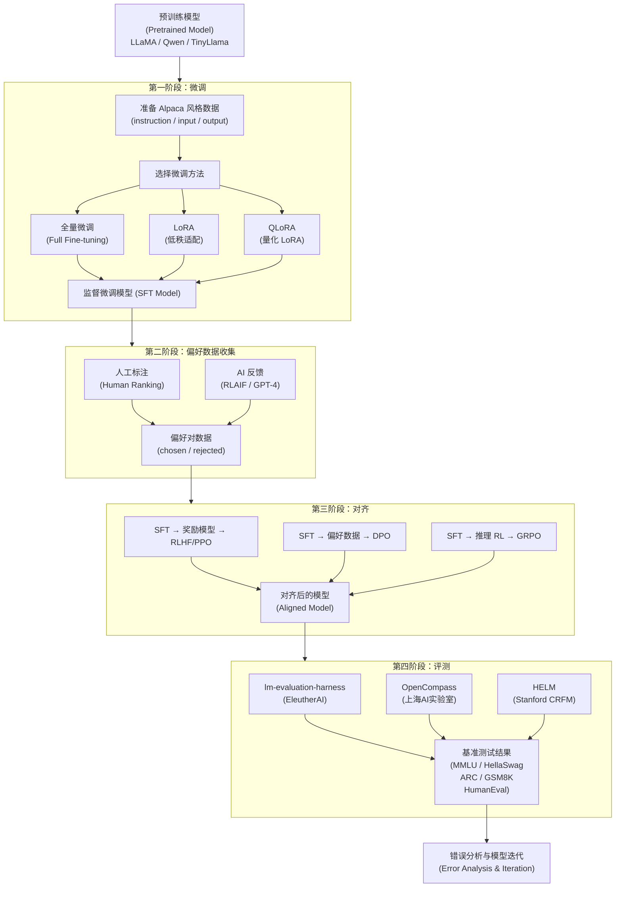

# 技术路线图

## LLM Post-training 技术路线图

使用 Mermaid 语法绘制，可粘贴到 https://mermaid.live 导出为 PNG/SVG/PDF。

## 如何使用

1. 复制上方 Mermaid 代码
2. 打开 https://mermaid.live
3. 粘贴代码，右侧即可预览
4. 点击导出按钮，选择 PNG 或 SVG 格式下载
5. 将下载的图片命名为 `technical_roadmap.png` 放入 `figures/` 目录

## 替代方案

也可以使用以下工具绘制：
- **draw.io**：https://app.diagrams.net（免费在线工具）
- **PowerPoint**：使用流程图模板
- **Visio**：专业流程图工具
- **LaTeX TikZ**：学术论文制图
